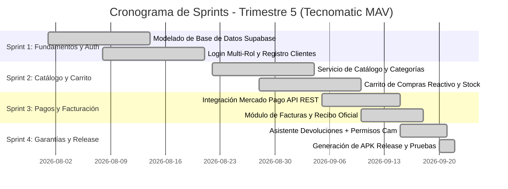

# Evidencia de Metodología Ágil (Scrum) - Proyecto Móvil Tecnomatic MAV

**Fase Académica:** Trimestre 5  
**Marco de Trabajo:** Scrum & Kanban  
**Herramientas de Gestión:** Trello / Jira / GitHub Projects  

---

## 1. Roles del Equipo Scrum

| Rol Scrum | Integrante(s) | Responsabilidades Clave |
| :--- | :--- | :--- |
| **Product Owner** | Esteban | Definición de visión del producto, priorización del Product Backlog y validación de criterios de aceptación. |
| **Scrum Master** | Dylan | Facilitación de ceremonias ágiles (Sprint Planning, Daily, Review, Retrospective) y remoción de impedimentos. |
| **Development Team** | Sara, Jhonny, Esteban, Dylan | Diseño UI/UX en Flutter, arquitectura de servicios, integración API REST Supabase y generación de builds nativos (APK). |

---

## 2. Product Backlog y Épicas

* **ÉPICA 1: Autenticación y Seguridad Multi-Rol**
* **ÉPICA 2: Catálogo de Productos y Filtros Inteligentes**
* **ÉPICA 3: Carrito de Compras y Pasarela de Pago**
* **ÉPICA 4: Facturación Electrónica y Recibos Oficiales**
* **ÉPICA 5: Sistema de Garantías, Devoluciones y Permisos de Hardware**
* **ÉPICA 6: Módulos Administrativos y Financieros (Admin & Contador)**

---

## 3. Historias de Usuario (User Stories)

### HU-01: Inicio de Sesión Multi-Rol
* **Como:** Usuario de Tecnomatic MAV (Cliente, Administrador o Contador).
* **Quiero:** Iniciar sesión con mi correo electrónico y contraseña en la aplicación móvil.
* **Para:** Acceder al panel y funcionalidades acordes a mi rol.
* **Criterios de Aceptación:**
  * **Dado** que estoy en la pantalla de Login.
  * **Cuando** ingreso credenciales válidas y presiono "Iniciar Sesión".
  * **Entonces** el sistema valida el token JWT y me redirige a mi panel correspondiente (Catálogo, Admin Dashboard o Generador de Recibos).

---

### HU-02: Registro de Clientes Nuevos
* **Como:** Nuevo cliente industrial.
* **Quiero:** Registrar mis datos personales y crear una cuenta desde la app móvil.
* **Para:** Realizar pedidos y consultar mi historial de compras.
* **Criterios de Aceptación:**
  * **Dado** que ingreso nombres, apellidos, correo válido y contraseña de mínimo 6 caracteres.
  * **Cuando** presiono "Registrarme".
  * **Entonces** el usuario se guarda en la tabla `Usuarios` de Supabase con rol `Cliente` y se inicia sesión automáticamente.

---

### HU-03: Catálogo y Filtro por Categorías
* **Como:** Cliente interesado en dotaciones industriales.
* **Quiero:** Filtrar los productos por categoría (Cascos, Guantes, Botas, Chalecos, Camisas, Pantalones).
* **Para:** Encontrar rápidamente los artículos que necesito con su stock en tiempo real.
* **Criterios de Aceptación:**
  * **Dado** que estoy en la pestaña Catálogo.
  * **Cuando** selecciono el chip de categoría "Guantes".
  * **Entonces** se muestran únicamente los guantes registrados en Supabase con su precio y stock disponible.

---

### HU-04: Carrito de Compras y Checkout
* **Como:** Cliente comprador.
* **Quiero:** Añadir productos al carrito, modificar cantidades y procesar el pedido.
* **Para:** Realizar una orden de compra segura.
* **Criterios de Aceptación:**
  * **Dado** que tengo artículos en mi carrito.
  * **Cuando** completo mis datos de entrega y presiono "Pagar".
  * **Entonces** se crea la orden en `Facturas`, los ítems en `Detalle_Facturas` y se descuenta el inventario en `Stock`.

---

### HU-05: Generación y Consulta de Recibos Oficiales
* **Como:** Cliente y Contador de la empresa.
* **Quiero:** Visualizar el recibo de compra oficial (`RC-XXXX`) con desglose de impuestos y datos fiscales.
* **Para:** Respaldar contablemente la transacción comercial.
* **Criterios de Aceptación:**
  * **Dado** un pedido registrado en estado Pagado.
  * **Cuando** presiono "Generar Recibo" en la app.
  * **Entonces** se abre el comprobante oficial con número de recibo, cliente, NIT comercial, tabla de artículos, subtotal e IVA.

---

### HU-06: Solicitud de Garantía y Devolución con Evidencia Fotográfica
* **Como:** Cliente con un producto defectuoso o talla incorrecta.
* **Quiero:** Solicitar una devolución adjuntando fotografías desde la cámara o galería del celular.
* **Para:** Tramitar el cambio de producto o solicitar un cupón del 100%.
* **Criterios de Aceptación:**
  * **Dado** que el cliente ingresa a la pestaña Devoluciones.
  * **Cuando** selecciona su factura de referencia, captura la foto con la cámara y envía el motivo.
  * **Entonces** la app solicita el permiso nativo de cámara en tiempo de ejecución y registra la devolución en `Devoluciones`.

---

## 4. Cronograma de Sprints (Trimestre 5)

---

## 5. Definición de Hecho (Definition of Done - DoD)
Para considerar una funcionalidad como completada:
1. Código desarrollado en Flutter bajo patrones limpios y arquitectura modular.
2. `flutter analyze` ejecutado con **0 errores y 0 advertencias**.
3. Consumo e inserción verificada en la base de datos de producción Supabase.
4. Pruebas funcionales de interfaz y permisos nativos (Cámara, Galería, Almacenamiento).
5. Compilación exitosa del binario APK Release.
